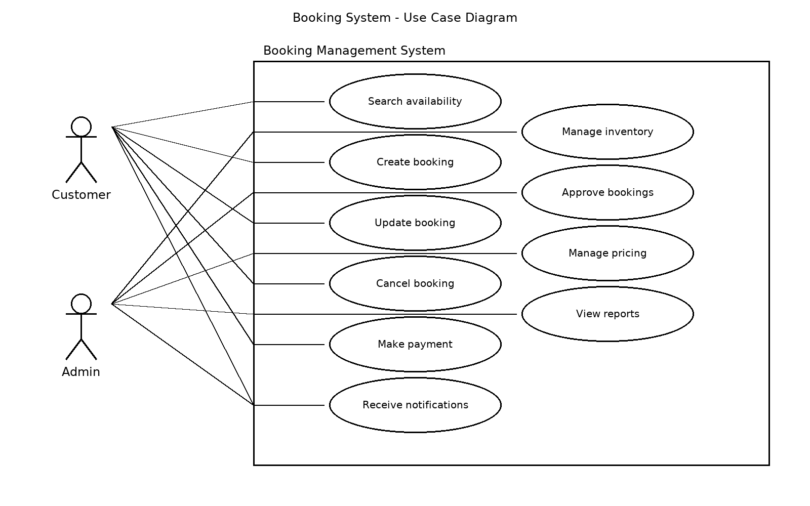

## What is Requirement Analysis?

Requirement Analysis bridges the gap between what stakeholders want and what developers deliver. It is a mandatory step to ensure that the SDLC is successful, efficient, and user-focused product output.

## Why is Requirement Analysis Important?

Requirement Analysis is a critical step in the Software Development Lifecycle (SDLC) because it directly impacts the success of the project. Its significance can be understood through the following reasons:

1. **Clarity and Alignment**  
   It ensures all stakeholders share a clear understanding of the project scope, objectives, and expected outcomes. This alignment minimizes confusion and keeps the development team focused on the right goals.

2. **Cost and Time Efficiency**  
   Identifying requirements early helps detect gaps, conflicts, or unrealistic expectations before development starts. This reduces the risk of costly rework, saving both time and resources.

3. **Improved Quality and User Satisfaction**  
   Well-documented requirements form the basis for design, implementation, and testing. This ensures the final product meets user needs, aligns with business goals, and delivers higher satisfaction.

## Key Activities in Requirement Analysis

Requirement Analysis involves several structured activities to ensure that the final product meets stakeholder needs. The five key activities are:

- **Requirement Gathering**  
  Collecting information from stakeholders, end-users, and business documents to understand the needs of the system.

- **Requirement Elicitation**  
  Engaging with stakeholders through interviews, workshops, surveys, or observations to uncover explicit and hidden requirements.

- **Requirement Documentation**  
  Recording requirements in a clear, structured, and accessible format such as requirement specifications, user stories, or use cases.

- **Requirement Analysis and Modeling**  
  Examining requirements for completeness, consistency, and feasibility, and representing them through models like data flow diagrams or UML to visualize system behavior.

- **Requirement Validation**  
  Reviewing and confirming requirements with stakeholders to ensure they are accurate, realistic, and aligned with business goals before development begins.

## Types of Requirements

### Functional Requirements
Functional requirements describe what the system should do. They define the core features and interactions of the system.

Examples for the booking management project:
- Users can create, view, update, and cancel bookings.
- The system sends email or SMS confirmations after a booking is completed.
- Admins can manage available slots, pricing, and booking approvals.
- The system allows users to search for available dates and times.
- Payment integration enables users to complete bookings securely online.

### Non-functional Requirements
Non-functional requirements describe how the system should perform. They define the quality attributes, constraints, and standards the system must meet.

Examples for the booking management project:
- The system should handle up to 1,000 concurrent users without performance issues.
- Bookings and payment data must be encrypted to ensure security and privacy.
- The application should load within 3 seconds for users on standard internet speeds.
- The system should be accessible on both desktop and mobile devices.
- The platform should have 99.9% uptime to ensure reliability.

## Use Case Diagrams

Use Case Diagrams show how users interact with a system. They map actors, their goals, and the system’s responses. You use them to clarify scope, align stakeholders, and spot gaps early.

Benefits
- Aligns business, design, and engineering on scope.
- Exposes missing or conflicting requirements.
- Guides UI flows, test cases, and backlog items.
- Keeps focus on user goals, not screens.

### Booking System Use Case Diagram

Actors
- Customer
- Admin

Key Use Cases
- Search availability
- Create booking
- Update booking
- Cancel booking
- Make payment
- Receive notifications
- Manage inventory
- Approve bookings
- Manage pricing
- View reports

Diagram

## Acceptance Criteria

Acceptance Criteria are the conditions that a software feature must meet to be accepted by stakeholders. They serve as a checklist that defines what "done" means for a requirement or user story.

### Importance of Acceptance Criteria
- Provide clarity by defining exact expectations for a feature.
- Reduce ambiguity between stakeholders, developers, and testers.
- Support test case creation, making validation easier.
- Ensure alignment with business objectives and user needs.
- Act as a baseline for measuring completion and quality.

### Example: Checkout Feature in the Booking Management System

**Feature**: Checkout Process

**Acceptance Criteria**:
- User can review selected booking details (date, time, service, and price) before payment.
- System displays total cost, including applicable taxes or fees.
- User can enter valid payment details and submit payment securely.
- System should confirm successful payment with a message and booking reference number.
- If payment fails, system displays an error message and allows retry.
- Confirmation email or SMS is sent to the user with booking details after successful checkout.

